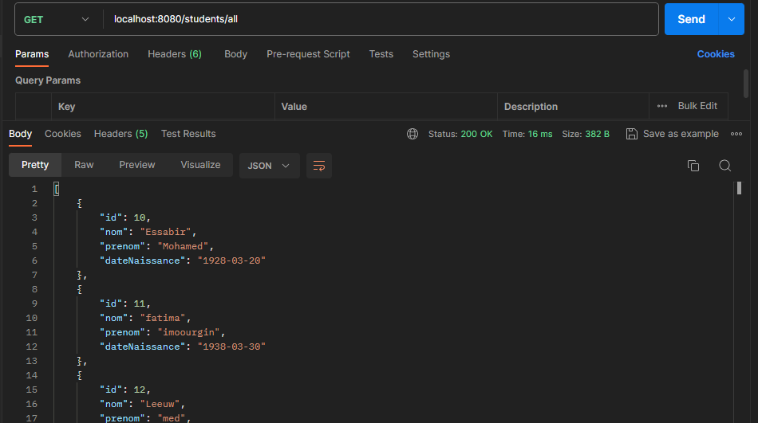
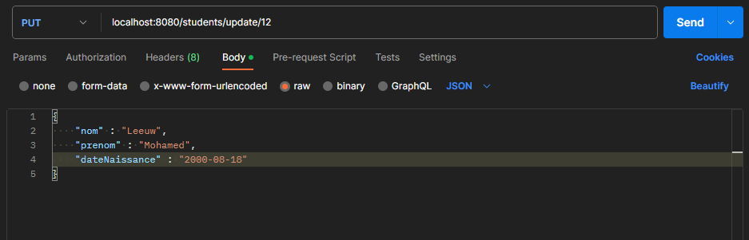

# TP : Déploiement d’une application avec Spring Boot

## Endpoints available:

### /students/save

#### Result after creating a student:

### students/save_all

#### Result after creating a list of students:

### students/{id}

### students/get_all

### Count

### Update

#### Result of update birthdate of student `Leeuw`:

### delete

#### Result of deletion of the student `Leeuw:

